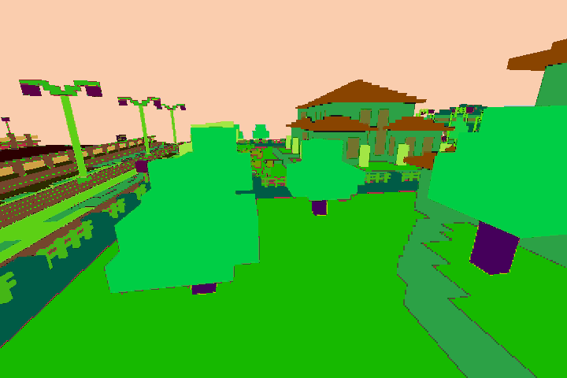
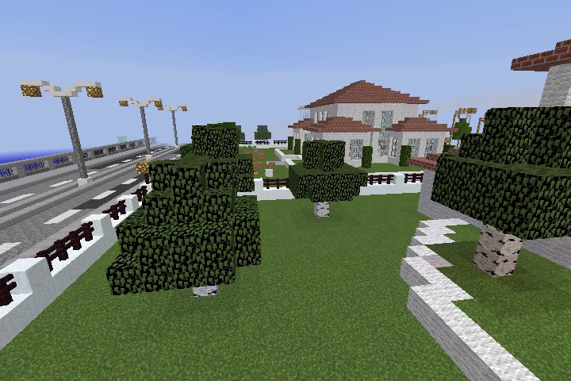
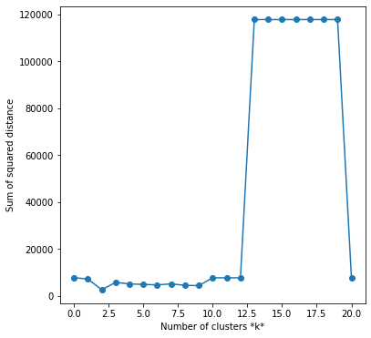
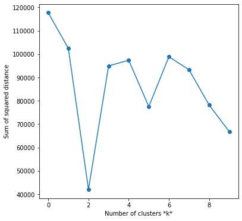
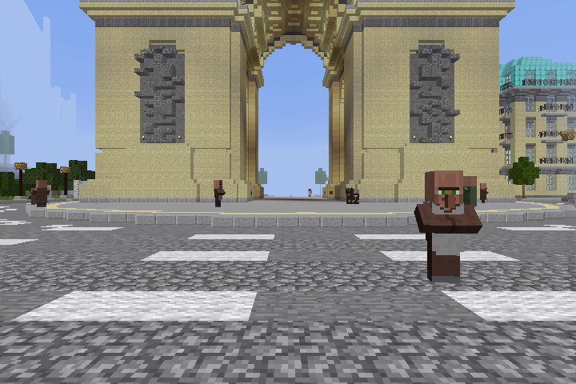
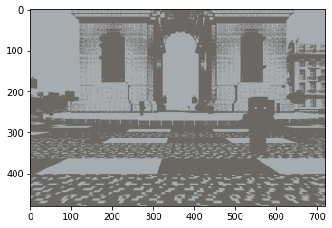
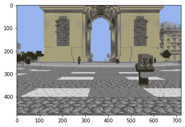
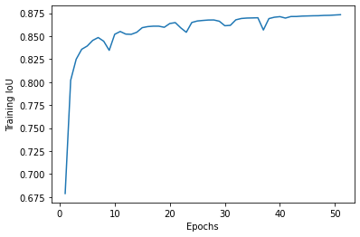
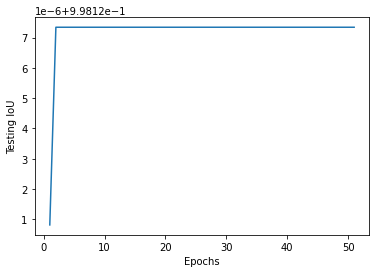

## Video (this is old video, we need to update... delete this when updated)

<iframe width="560" height="315" src="https://www.youtube.com/embed/brrMn67sN6M" frameborder="0" allow="accelerometer; autoplay; encrypted-media; gyroscope; picture-in-picture" allowfullscreen></iframe>

## Project Summary

Our goal for this project went through many iterations, we began by trying to figure out a project that was feasible while also piquing our interests. We had some project ideas before such as agent battle royale but ultimately settled on an image classification problem known as semantic segmentation. Semantic segmentation involves classifying each pixel of an image to some class e.g. water, sky, dirt(figure 1 maybe the video, ground truth, predictions image).

A combination of Malmo functions made it possible for us to determine what block/entities were on the player's screen, however, this does not apply to normal Minecraft. In normal Minecraft, the only way to determine the location and type of blocks/entities that are contained within the player's perspective is by having someone who is qualified manually look and decide. In Malmo we can generate color maps that have corresponding colors for each block/entity. To semantically segment normal Minecraft without someone manually annotating images it is necessary to apply machine learning algorithms.

 

 

## Approaches
Before we could apply any machine learning algorithms to aid us in our semantic segmentation task we needed to create the ground truth images for our training and test set.
this introduced The main obstacle of the project, Malmos color map producer. The color maps that Malmo returns although visually identify each entity/block with a unique color in practice this is not the case, for each block/entity there were tens of thousands of very similar-looking although unique colors that identified each block/entity (figure 2 the fucked up image with a lot of white). We had to find a way to compare all these similar colors and group them to create the ground truth images for our semantic segmentation algorithms. To solve this we found the most dominant color for each class, then converted every RGB image to a CIELAB color space, and then compared each color to one another using the CIEDE2000 formula to find which were the most similar to their respective dominant colors. In doing so we had 132 different classes each with their unique color, this let us convert every RGB image into a greyscale image containing numbers from 0-132(figure 3 a normal RGB mask).

For our semantic segmentation problem, we used a neural network following the DeepLabv3 architecture pre trained on resnet 101 as our model of choice.

Data Gathering

One of our main challenges was the initial data gathering for our model. As part of our data, we needed images and ground truths of the Minecraft player view as the agent moves throughout the world. We approached this by recording the player perspective in spectator view (as to remove the player model’s hand) using MissionRecordSpec.recordMP4(TimestampedVideoFrame.FrameType, frames_per_second, bit_rate) as it walked through a Minecraft map. This allowed us to gather images of the player’s screen and ground truth at set time intervals. As the player moved, we also took a scan of the surrounding environment to determine types of blocks/entities, block/entity location, and whether these blocks/entities were visible to the agent as a collection. The combination of these resulted in a mapping of 1.32 million colors to 180 classes throughout the world achieved with the python-colormath package. This was a one-to-one mapping and generated a color mask of our image. 

Original

Ground Truth

One-to-One mapping (using color map)

This method of data gathering can generate a surplus of data. The over 13000 images generated were also of decent resolution, so we agreed that we would need a model that would use more data to minimize overfitting, but as a result may take a longer time to run.

Our Model

(talk about model)

Since our model would be fed a lot of data, there would be some immediate advantages and disadvantages. 

Advantages

A lot of data lessens the impact of overfitting although it does not completely eliminate it. Later in the evaluation, we can determine if our model had been overfitting or not. Having more data will compensate better for the features in our model which can reduce the variance in our model. A disadvantage of small datasets is possible bias, but since our dataset is very large most of the bias should be eliminated.

Disadvantages

## Evaluation

### Elbow Method for K-Means Evaluation

For part of our K-means evaluation, we wanted to choose the optimal value of k. There were over 100 different colors and possible clusters, so we wanted an ideal k for that represented the sum of our images. We chose the elbow method which determined the optimal value for k based on the sum of squared distances (SSE) between data points and the cluster centroids. We first evaluated using the elbow method on one image with k=40 and then proceeded to test this multiple times to a numerous sample of images:

Elbow Method on one image:

 

Elbow Method on a sample of images:

 

Looking at the example graph, it would seem k=2 would be a clear choice for optimality, however we chose not to go with k value because we believed there may have been too much bias of our player perspective from looking at the blue sky or gray cobblestone floor. We chose the k value of 8 as from the sum of our tests, it seemed to be the next most optimal k value.

We applied k=2 and k=8 to our images to see the difference between these values. The results are shown below:

Original:

 

k=2:

 

k=8:

 

### Intersection Over Union 

Intersection over Union (IoU) is a metric designed for evaluation of object detection, which was the perfect metric to use in our model. For this metric, two bounds are used: the ground truth bounding boxes and the prediction bounding boxes from the model. The IoU is then calculated by divding the area of overlap and the area of union between the bounding boxes. Through 51 epochs, we used this metric and to evaluate our model. the graphs show the IoU values for the training and testing over these epochs.

Training IoU:

 

Testing IoU:

 

## References

https://pytorch.org/tutorials/recipes/recipes/saving_and_loading_a_general_checkpoint.html

https://www.pyimagesearch.com/2016/11/07/intersection-over-union-iou-for-object-detection/#:~:text=What%20is%20Intersection%20over%20Union,the%20popular%20PASCAL%20VOC%20challenge.

https://scikit-learn.org/stable/auto_examples/cluster/plot_kmeans_digits.html

https://en.wikipedia.org/wiki/CIELAB_color_space

https://github.com/chenxi116/DeepLabv3.pytorch

https://arxiv.org/pdf/1606.00915.pdf

https://neptune.ai/blog/image-segmentation-in-2020

https://python-colormath.readthedocs.io/en/latest/

https://pytorch.org/tutorials/recipes/recipes/custom_dataset_transforms_loader.html
