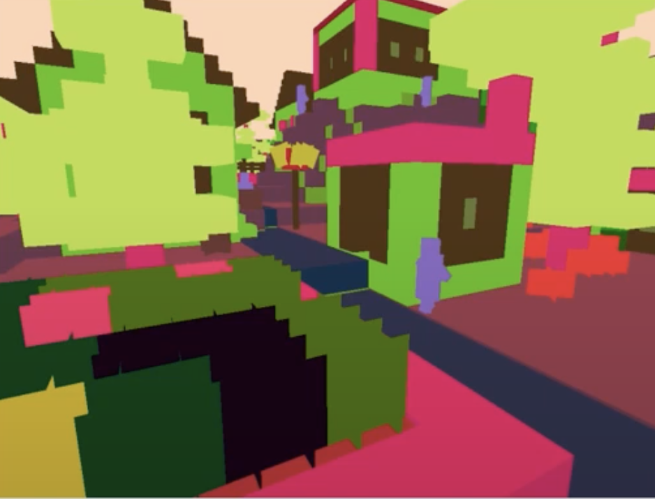

## Video (this is old video, we need to update... delete this when updated)

<iframe width="560" height="315" src="https://www.youtube.com/embed/brrMn67sN6M" frameborder="0" allow="accelerometer; autoplay; encrypted-media; gyroscope; picture-in-picture" allowfullscreen></iframe>

## Project Summary

Our goal for this project went through many iterations, trying to figure out a project that was feasible and would pique our interest. We had some crazy ideas before (agent battle royale), but settled on prediction of each pixel of the player perspective. This includes labeling of Minecraft structures including trees, house, and lake as classes. A combination of given Malmo functions would be able to determine block/entity identity, but in order to classify structures and evaluate its accuracy, we needed to use machine learning algorithms.

An obstacle was using Malmo's functionality to get the location of block/entity, determine whether or not it was in player's view, figure the type of block/entity, and the structure that it was apart of. We had a lot of information to use to decipher simply reading the blocks on the player's screen. Part of our solution involved generating a color map and matching the color ID of the screen to blocks/entities in Minecraft. An example of a generated color map is seen below:

## Approaches

## Evaluation

### Elbow Method for K-Means

For part of our K-means evaluation, we wanted to choose the optimal value of k. There were over 100 different colors and possible clusters, so we wanted an ideal k for that represented the sum of our images. We chose the elbow method which determined the optimal value for k based on the sum of squared distances (SSE) between data points and the cluster centroids. We first evaluated using the elbow method on one image with k=40, which resulted in this graph:

We proceeded to apply this to a sample of 10 distinct images which resulted in this:

Looking at the graph, it would seem k=2 would be a clear choice for optimality, however we chose not to go with k value because we believed there may have been too much bias of our player perspective from looking at the blue sky or gray cobblestone floor. We chose the next best k value which was k=8 for this reason.

Intersection over Union (IoU) is a metric designed for evaluation of object detection, which was the perfect metric to use in our model. For this metric, two bounds are used: the ground truth bounding boxes and the prediction bounding boxes from the model. An example of each bounding box is shown below:

Original Player View:

Ground Truth Bounding Boxes:

Prediction Bounding Boxes

The IoU is then calculated by divding the area of overlap and the area of union between the bounding boxes

## References

https://pytorch.org/tutorials/recipes/recipes/saving_and_loading_a_general_checkpoint.html
https://www.pyimagesearch.com/2016/11/07/intersection-over-union-iou-for-object-detection/#:~:text=What%20is%20Intersection%20over%20Union,the%20popular%20PASCAL%20VOC%20challenge.
https://scikit-learn.org/stable/auto_examples/cluster/plot_kmeans_digits.html
