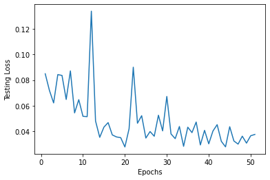

## Video (this is old video, we need to update... delete this when updated)

 <iframe width="560" height="315" src="https://www.youtube.com/embed/brrMn67sN6M" frameborder="0" allow="accelerometer; autoplay; encrypted-media; gyroscope; picture-in-picture" allowfullscreen></iframe> 

## Project Summary

  Our goal for this project went through many iterations, we began by trying to figure out a project that was feasible while also piquing our interests. We had some project ideas before such as agent battle royale but ultimately settled on an image classification problem known as semantic segmentation. Semantic segmentation involves classifying each pixel of an image to some class e.g. water, sky, dirt.

#### Example of Segmented Image

 

  A combination of Malmo functions made it possible for us to determine what block/entities were on the player's screen, however, this does not apply to normal Minecraft. In normal Minecraft, the only way to determine the location and type of blocks/entities that are contained within the player's perspective is by having someone who is qualified manually look and decide. In Malmo we can generate color maps that have corresponding colors for each block/entity. To semantically segment normal Minecraft without someone manually annotating images it is necessary to apply machine learning algorithms.

#### Original Minecraft Player View

 

#### Color Map

 

## Approaches

### Data Gathering

  Before we could apply any machine learning algorithms to aid us in our semantic segmentation task we needed to create the ground truth images for our training and test set. This introduced one of the obstacles of the project, Malmos color map producer. The color maps that Malmo returns although visually identify each entity/block with a unique color in practice this is not the case, for each block/entity there were tens of thousands of very similar-looking although unique colors that identified each block/entity.

#### Initial Attempt at One-to-One Mapping

 

  We had to find a way to compare all these similar colors and group them to create the ground truth images for our semantic segmentation algorithms. To solve this we found the most dominant color for each class, then converted every RGB image to a CIELAB color space, and then compared each color to one another using the CIEDE2000 formula to find which were the most similar to their respective dominant colors. In doing so we had 132 different classes each with their unique color, this let us convert every RGB image into a greyscale image containing numbers from 0-132.

#### Ground Truth Color Map

 

  We then created a algorithm to automate the label making processes by teleport the agent randomly around the surface of the minecraft world while recording both, color map and normal video which resulted in a dataset of 13000 images with a resolution of 480x720. 

### Baseline Model: K-Means

Comparison of the colors within an RGB image is done by a Euclidean distance which is simply

 $O(mnr*d)r^2 = x^2 + y^2 $ 

#### Advantages
#### Disadvantages
### Our Best Model: DeepLabV3

For our semantic segmentation problem, we used a neural network following the DeepLabv3 architecture pre trained on resnet 101 as our model of choice with a focal loss function.

#### Predicted Image  

 

####
#### Advantages

There are multiple advantages to using our DeepLabv3 approach for Minecraft segmentation.
The biggest advantage is that the neural network approach is very accurate in its predictions as seen in the evaluation section. Another benefit is given a dataset where we know what labels correspond to each class we are able to determine what blocks/entities are contained in a single image and what their location is within the image. The model is also able to generalize very well to the large amount of classes.

#### Disadvantages

The model took a large amount of space in memory, the model itself was around 14 Gigs in size which left little remaining memeory on our gpu. we had to then determine wether we would rather have a larger image or a larger batch size where we ultimately chose a larger image size. another con is how long it took to train, each batch took around 13 seconds on average to complete which led to one epoch taking around 12 hours to complete.

## Evaluation

### Elbow Method for K-Means Evaluation

For part of our K-means evaluation, we wanted to choose the optimal value of k. There were over 100 different colors and possible clusters, so we wanted an ideal k for that represented the sum of our images. We chose the elbow method which determined the optimal value for k based on the sum of squared distances (SSE) between data points and the cluster centroids. We first evaluated using the elbow method on one image with k=40 and then proceeded to test this multiple times to a numerous sample of images:

#### Elbow Method on one image:

 

#### Elbow Method on a sample of images:

 

Looking at the example graph, it would seem k=2 would be a clear choice for optimality, however we chose not to go with k=2 because we found that the model was clustering between the sky and everything else. We chose the k value of 8 as from the sum of our tests, it seemed to be the next most optimal k value.

We applied k=2 and k=8 to our images to see the difference between these values. The results are shown below:

#### Original:

 

#### k=2:

 

#### k=8:

 

### Intersection Over Union 

Intersection over Union (IoU) is a metric designed for evaluation of object detection, which was the perfect metric to use in our model. For this metric, two bounds are used: the ground truth bounding boxes and the prediction bounding boxes from the model. The IoU is then calculated by divding the area of overlap and the area of union between the bounding boxes. Through 51 epochs, we used this metric and to evaluate our model. the graphs show the IoU values for the training and testing over these epochs.

#### Training IoU:

 

#### Testing IoU:

 

An IoU value that is closer to 1 means it is more accurate. In the training, the IoU starts at 0 and quickly increases towards 0.9-1.0 which indicates our model is able to learn quickly and accurately. 

### Loss Function

The loss functions for the training and testing data were graphed over 51 epochs. These represent the cost of our model and a good loss should decrease over time.

#### Training Loss

 

#### Testing Loss

 

From these graphs, we can interpret that our model was able to learn at a a quick rate. Both the training and testing were "spiky" and not smooth, but there was a consistent trend downwards at a curve. The training loss is not more accurate and also does not overfit the testing data, so our model is proven to work well. 

## References

https://pytorch.org/tutorials/recipes/recipes/saving_and_loading_a_general_checkpoint.html

https://www.pyimagesearch.com/2016/11/07/intersection-over-union-iou-for-object-detection/#:~:text=What%20is%20Intersection%20over%20Union,the%20popular%20PASCAL%20VOC%20challenge.

https://scikit-learn.org/stable/auto_examples/cluster/plot_kmeans_digits.html

https://en.wikipedia.org/wiki/CIELAB_color_space

https://github.com/chenxi116/DeepLabv3.pytorch

https://arxiv.org/pdf/1606.00915.pdf

https://neptune.ai/blog/image-segmentation-in-2020

https://python-colormath.readthedocs.io/en/latest/

https://pytorch.org/tutorials/recipes/recipes/custom_dataset_transforms_loader.html
