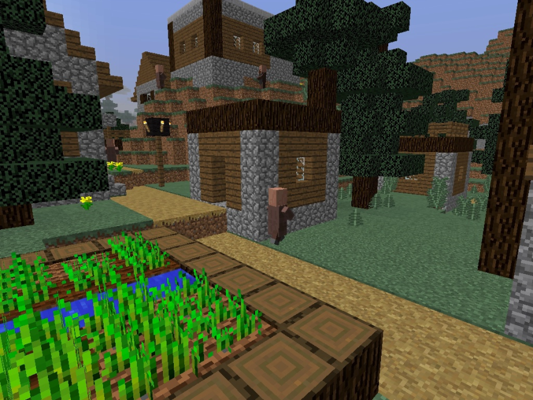
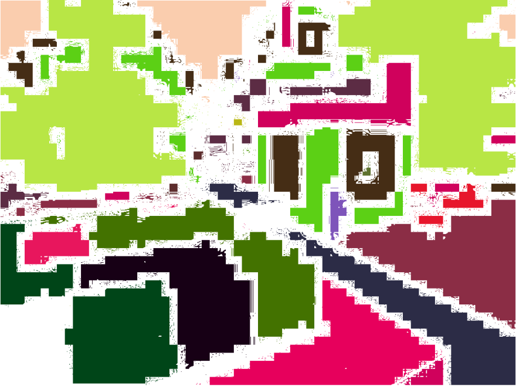
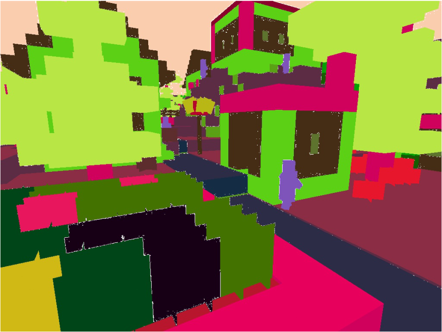
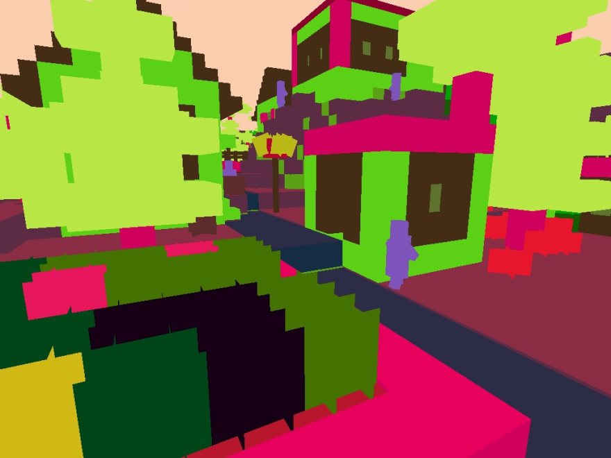

Summary:
Semantic Segmentation involves segmenting the agent player's view and labeling not just the individual blocks, but the
general structures that may appear in Minecraft such as a tree, a building, or a pond. The goal is for both performance
and time to be as optimal as possible, so that it can be run while the agent walks around in the world.

Approach:
Our approach can be broken into a few steps. The first step was data gathering which was a little more complicated than it
may seem. In order for us to train data, we needed to know the all the blocks and entities on the player's screen as well as
the location and its distance from the player. We achieved this by scanning the area to know each available type of block,
receiving a 3D array and sifting through each element to determine the surface visible to the player. After the data is obtained,
it is fed into the trainig algorithm where it will be trained across numerous datasets to make it as accurate as possible. 

A k-means algorithm will also be along the side to give us an approximate evaluation of the performance of our algorithm 
which we will use to compare the results and accuracy of the labeling. This evaluation will come first before moving onto
an evaluation of the algorithm's efficiency. Since the semantic segmentation must be running and outputting in real time,
the efficiency of the algorithm is also an important metric in insuring that it can be as accurate as possible in the least
amount of time. Some sacrifices may be made to accuracy to add to time.

Images created from our work:

First Image: Original Environment
Second Image: First attempt at segmentation
Third Image: Second Attempt at segmentation (current image)
Fourth Image: Malmo Color Map version

Evaluation: The first evaluation metric that we will utilize is IOU validation (Intersect over union). This type of validation measures
exactly what we need, the accuracy of an object detector over a dataset, in this case over blocks in minecraft. The evaluation
metric creates a predicted bounding box of where the image is located on the screen where its error from the ground bounding
box can be measured. IOU can not be directly used as an algorithm, rather its sole purpose is evaluation of our model. 

We will also be using a k-means algorithm that will run alongside as validation data. K-means will cluster regions of the agent view and,
similarly to the IOU validation, identify locations of the structures. We will then compare this to our experimental data
set and focus on reducing the possible errors. K-means should be a much quicker algorithm, but be a little less accurate,
so a gap between that data and the generated data is expected. The combination of k-means with IOU allows us to determine if
that gap is of enough significance.

Remaining Goals and Challenges:
We are attempting to train the data in the person's view to label the different structures including tree and building. This is
achieved by adding a deep learning algorithm and a reinforcement learning algorithm which we are currently sifting through 
the details for. The algorithm ideas and implementation were the re sult of researchhing reading multiple learning algorithms that
have been implemented into real life semantic segmentations. These algorithms are often much more detailed and account for a lot
more than we may need for Minecraft because ultimately, there are more details in the real world than Minecraft. We will end by 
the evaluation where a quick k-means algorithm will be used to evaluate the performance of the implemented learning algorithms.

Resources Used:
https://en.wikipedia.org/wiki/CIELAB_color_space
https://github.com/chenxi116/DeepLabv3.pytorch
https://arxiv.org/pdf/1606.00915.pdf
https://neptune.ai/blog/image-segmentation-in-2020
https://python-colormath.readthedocs.io/en/latest/

